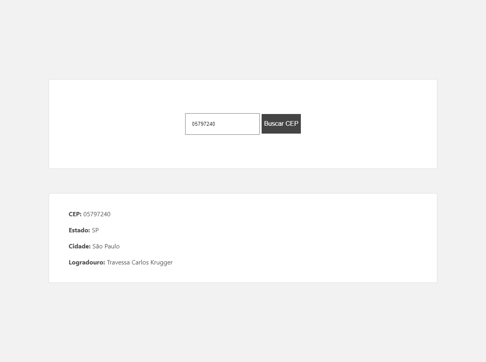

# Busca CEP



## Começando

Primeiro, execute o servidor de desenvolvimento: 

```bash
npm run dev
# or
yarn dev
```

Abra [http://localhost:3000](http://localhost:3000) no seu navegador para ver o resultado. 

### Deploy:
<p align="center">https://desafio-front-ten.vercel.app</p>
